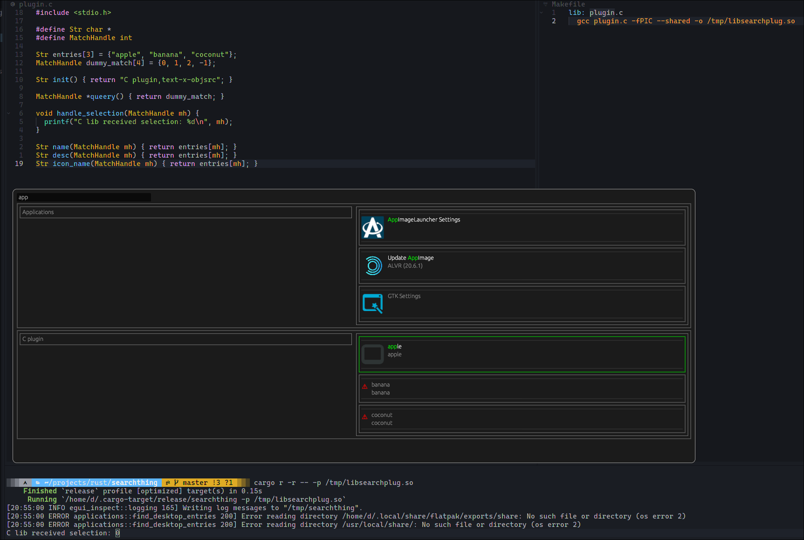

# SearchThing

A very basic runner/search&select dialogue, heavily inspired by [anyrun](https://github.com/anyrun-org/anyrun) (and making use of its desktop file enumeration).
The main differences being: using `egui` rather than gtk bindings for ui, and using `libloading` rather than `abi_stable` for plugins.
This is mostly in an attempt to simplify code, the latter also leaves developing plugins outside of rust as a possiblity.
Also, not everything is dynamically loaded, this is left for external plugins. 
Basic search modules, such as for applications, are statically compiled into the runner, and a plugin module can be used to load a searcher from a `*.so`.
The `wl-copy` binary is relied upon for copying symbols to the clipboard in the `--symbols` module.

Example: 

`cargo r -r -- --no-builtin-modules -p /tmp/libsearchplug.so -p $CARGO_TARGET_DIR/release/libexample_rust_plugin.so`
